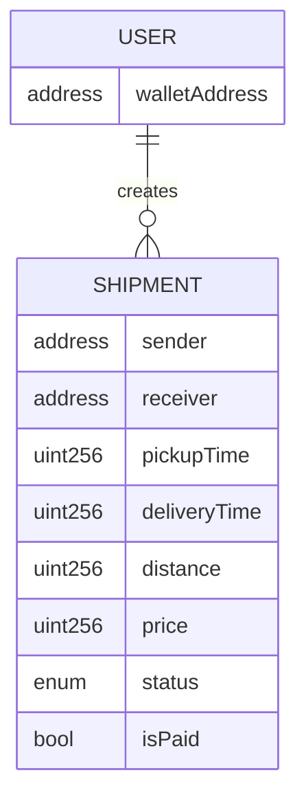

# Supply Chain Management DApp

A blockchain-based Supply Chain Management application that enables secure, transparent, and immutable tracking of shipments. Built with Next.js and Hardhat, this DApp allows users to create, track, and complete shipments on the Ethereum (or compatible EVM) blockchain.

## Key Features

*   **Create Shipments**: Users can create new shipments with details like receiver, pickup time, distance, and price.
*   **Shipment Lifecycle**:
    *   **Pending**: Initial state upon creation.
    *   **In Transit**: Triggered when the shipment is started.
    *   **Delivered**: Final state upon completion, triggering payment release.
*   **Payment Escrow**: The shipment price is paid upfront by the creator and held by the contract until delivery is verified.
*   **Profile**: View a list of shipments created by the connected user.
*   **Global Tracking**: Ability to retrieve a list of all transactions/shipments on the network.

## Tech Stack

*   **Frontend**: Next.js 13, React 18
*   **Styling**: Tailwind CSS, Ant Design
*   **Blockchain**: Hardhat (local development), Polygon Amoy (testnet)
*   **Smart Contracts**: Solidity (v0.8.0+)
*   **Interaction**: Ethers.js v5, Web3Modal

## Architecture

```mermaid
graph LR
  ui[\"Next.js / React UI\"]
  ctx[\"TrackingContext (Ethers.js)\"]
  wallet[\"MetaMask / Wallet\"]
  rpc[\"JSON-RPC (Hardhat / RPC Provider)\"]
  chain[\"EVM Network (Hardhat / Polygon Amoy)\"]
  contract[\"Tracking.sol Smart Contract\"]

  ui -->|calls actions| ctx
  ctx -->|requests signatures & sends tx| wallet
  wallet -->|eth_sendTransaction / eth_call| rpc
  rpc -->|forwards JSON-RPC| chain
  chain -->|executes & stores state in| contract
```

## Smart Contract Overview

The `Tracking.sol` contract manages the state and lifecycle of shipments.

### Data Structures

*   **Shipment Struct**:
    *   `sender`: Address of the shipment creator.
    *   `receiver`: Address of the intended recipient.
    *   `pickupTime`: Timestamp of pickup.
    *   `deliveryTime`: Timestamp of delivery.
    *   `distance`: Distance of the shipment.
    *   `price`: Cost of the shipment.
    *   `status`: Current status (`PENDING`, `IN_TRANSIT`, `DELIVERED`).
    *   `isPaid`: Boolean indicating if the sender has been paid.
*   **ShipmentStatus Enum**: `PENDING`, `IN_TRANSIT`, `DELIVERED`.

### Key Functions

*   `createShipment`: Creates a new shipment and requires `msg.value` to equal the `price`.
*   `startShipment`: Transitions status to `IN_TRANSIT`.
*   `completeShipment`: Transitions status to `DELIVERED` and transfers the payment to the sender.
*   `getAllTransactions`: Returns a global list of all shipments.
*   `getShipment` / `getShipmentsCount`: Helpers for retrieving shipment data.

### Data Model



## Installation & Local Setup

1.  **Clone the repository**:
    ```bash
    git clone <repository-url>
    cd supply-chain-management-dapp
    ```

2.  **Install dependencies**:
    ```bash
    npm install
    ```

3.  **Start the local Hardhat node**:
    ```bash
    npx hardhat node
    ```

4.  **Deploy the contract**:
    In a separate terminal, run the deployment script to the local network:
    ```bash
    npx hardhat run scripts/deploy.js --network localhost
    ```
    *Note the deployed contract address from the output.*

5.  **Configure Environment Variables**:
    Create a `.env` file based on `.env.example` (or set manually).
    ```env
    NEXT_PUBLIC_CONTRACT_ADDRESS=<YOUR_DEPLOYED_ADDRESS>
    NEXT_PUBLIC_NETWORK=localhost
    ```

6.  **Run the frontend**:
    ```bash
    npm run dev
    ```
    Access the DApp at `http://localhost:3000`.

## Network / Deployment

The project is configured for deployment on **Polygon Amoy**.

*   **Configuration**: `hardhat.config.js` includes the `polygon_amoy` network setting.
*   **Deployment**:
    To deploy to Polygon Amoy, ensure you have a `PRIVATE_KEY` and `POLYGON_AMOY_RPC` set in your environment variables, then run:
    ```bash
    npx hardhat run scripts/deploy.js --network polygon_amoy
    ```

## Usage Flow

1.  **Connect Wallet**: Click the "Connect Wallet" button to link your MetaMask account.
2.  **Create Shipment**: Use the modal/form to enter shipment details (Receiver, Pickup Time, Distance, Price) and confirm the transaction.
3.  **View Shipments**:
    *   **All Shipments**: Browse the global list of shipments.
    *   **Profile**: View shipments specific to your account.
4.  **Manage Shipment**:
    *   **Start Shipment**: If you are the sender, initiate the shipment to change status to `IN_TRANSIT`.
    *   **Complete Shipment**: Finalize the delivery to change status to `DELIVERED` and release funds.

## Current Limitations

*   **Identity**: No verified identity system; relies on wallet addresses.
*   **Role Management**: Simplified model where any user can create and manage shipments; no distinct "Transporter" or "Retailer" roles enforced on-chain.
*   **Global Index**: The frontend currently relies on a global transaction list for indexing.
