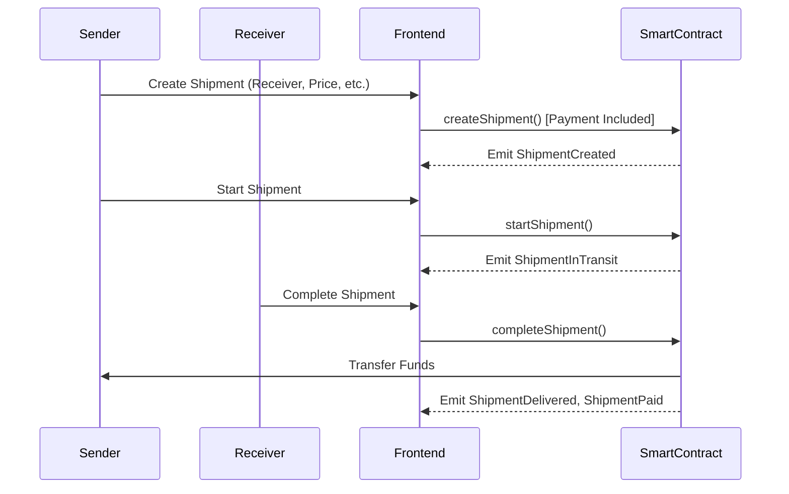
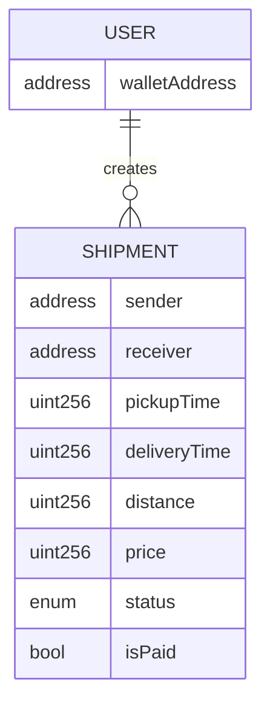

# Blockchain Supply Chain Management DApp

A decentralized application (DApp) for **tracking shipments on the blockchain** from creation to completion.

This project demonstrates how blockchain can be used to bring **transparency, auditability, and automation** to supply chain workflows. Using smart contracts, every shipment update is recorded on-chain, making it tamper-evident and verifiable by all participants.

---

## 🚀 Key Features

- **On-chain shipment tracking** – Create, start, and complete shipments using a smart contract.
- **End-to-end visibility** – View all shipments and their current status in a dashboard.
- **Trustless state transitions** – Shipment lifecycle enforced by Solidity smart contracts.
- **MetaMask integration** – Interact with the DApp using your Ethereum wallet.
- **Local blockchain setup** – Powered by Hardhat for fast local development.

---

## 🧰 Tech Stack

- **Frontend:** Next.js, React, Tailwind CSS
- **Web3:** Ethers.js, Web3Modal, MetaMask
- **Smart Contracts:** Solidity, Hardhat
- **Network (dev):** Hardhat local node (`localhost:8545`)

---

## 🏗️ Architecture

The application is built using a classic DApp architecture where the frontend interacts directly with the blockchain via a JSON-RPC provider (Metamask).

### High-Level Overview

1.  **User Interface (Next.js):** Users interact with the application through a web interface.
2.  **Web3 Provider (Metamask/Web3Modal):** Bridges the frontend to the Ethereum network, handling transaction signing.
3.  **Smart Contract (Solidity):** Resides on the blockchain and holds the state of all shipments and business logic.
4.  **Blockchain (Hardhat/Ethereum):** The immutable ledger that stores the data.

### Sequence Diagram: Shipment Lifecycle

The following diagram illustrates the flow of a shipment from creation to completion.



---

## 📊 Data Model (ER Diagram)

The smart contract uses a `Shipment` struct to store data. Since it is a solidity contract, "relations" are managed via mappings.



*   **User:** Identified by their Ethereum wallet address. A user can be a Sender or a Receiver.
*   **Shipment:** Contains all details about the cargo, including status (PENDING, IN_TRANSIT, DELIVERED) and payment state.

---

## 🛠️ Installation & Setup

### 1. Clone the repository

```bash
git clone https://github.com/Uchihaithachi/supply-chain-management-dapp.git
cd supply-chain-management-dapp
```

### 2. Install dependencies

```bash
npm install
```

This will install both the frontend and Hardhat-related dependencies defined in `package.json`.

---

## ⛓️ Hardhat: Local Blockchain & Contract Deployment

### 3. (Optional but recommended) Compile the contract

```bash
npx hardhat compile
```

### 4. Run a local Hardhat node

In **Terminal 1**:

```bash
npx hardhat node
```

This starts a local blockchain at `http://127.0.0.1:8545/` and prints a list of test accounts with private keys.

### 5. Deploy the contract to localhost

In **Terminal 2** (same project folder):

```bash
npx hardhat run --network localhost scripts/deploy.js
```

You should see output similar to:

```text
Tracking deployed to: 0x5FbDB2315678afecb367f032d93F642f64180aa3
```

Copy this **contract address** – you will need it for the frontend.

---

## 🌐 Frontend Configuration & Run

### 6. Configure the contract address (if required)

If your frontend uses a config/context file (for example):

- `Context/TrackingContext.js` or similar,

update the `CONTRACT_ADDRESS` (or equivalent constant) with the address printed by Hardhat:

```js
const CONTRACT_ADDRESS = "0x5FbDB2315678afecb367f032d93F642f64180aa3";
```

### 7. Start the Next.js dev server

```bash
npm run dev
```

By default, the app will be available at:

```text
http://localhost:3000
```

---

## 🦊 MetaMask Setup (Localhost)

1. Open **MetaMask**.
2. Add a new network (if not already present):

   - **Network Name:** Localhost 8545
   - **RPC URL:** `http://127.0.0.1:8545`
   - **Chain ID:** `31337` (default Hardhat chain ID)
   - **Currency Symbol:** ETH (optional)

3. Import one of the private keys printed by `npx hardhat node` so you can send transactions.
4. Open the DApp (`http://localhost:3000`) and click **Connect Wallet**.
5. Create a shipment, start it (as sender), and complete it (as receiver) to see the full flow.

---

## 🌍 Optional: Deploying with Remix & Polygon Mumbai

Although the project is set up with Hardhat for local development, you can also deploy the contract using **Remix IDE** and a testnet such as **Polygon Mumbai**.

### Remix IDE

- Open: [https://remix-project.org](https://remix-project.org)
- Create a new Solidity file (e.g., `Tracking.sol`) and paste the contract code.
- Compile and deploy using Injected Provider (MetaMask) connected to your desired network.

### Polygon Mumbai Explorer

- Explorer: [https://mumbai.polygonscan.com/](https://mumbai.polygonscan.com/)
- After deploying to Mumbai, you can verify the contract and interact with it from the explorer as well.

> ⚠️ Note: To fully use Mumbai with this DApp, you’ll need to:
>
> - Configure a Mumbai network entry in Hardhat (or deploy via Remix).
> - Update the frontend RPC / network and contract address accordingly.

---

## 📂 Project Structure (High-level)

```text
.
├── Components/         # React UI components (NavBar, Forms, Tables, Modals)
├── Context/            # Web3 context (contract connection & methods)
├── contracts/          # Solidity smart contracts (Tracking.sol)
├── scripts/            # Hardhat deployment scripts
├── pages/              # Next.js pages (_app.js, index.js)
├── public/             # Static assets
├── styles/             # Global styles (Tailwind, etc.)
├── package.json        # Dependencies and scripts
└── hardhat.config.js   # Hardhat configuration (if present)
```

---

## ✅ Next Steps / Possible Extensions

- Add **event-based updates** (listen to Shipment events in real time).
- Integrate a **testnet deployment** (Polygon Mumbai / Sepolia).
- Extend the contract for:

  - Multi-party approvals
  - Escrow payments
  - Dispute resolution / audits
