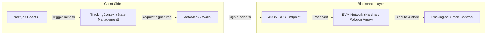
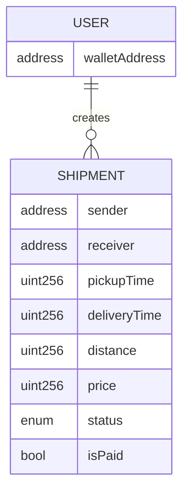

# Blockchain Supply Chain Management DApp

A decentralized application (DApp) for **tracking shipments on the blockchain** from creation to completion.

This project demonstrates how blockchain can be used to bring **transparency, auditability, and automation** into supply-chain workflows. Shipment lifecycle changes are driven by a smart contract on the Ethereum (or compatible EVM) network, and every update is recorded on-chain, making it tamper-evident and easily verifiable by all participants.

---

## 🚀 Key Features

*   **Create Shipments**: Users can create new shipments with verified parameters:
    *   Receiver address
    *   Pickup time
    *   Distance
    *   Price (paid upfront via `msg.value`)
*   **On-Chain Lifecycle Management**:
    *   **Pending**: Initial state upon creation.
    *   **In Transit**: Triggered when the shipment is started.
    *   **Delivered**: Final state upon completion, triggering payment release to the sender.
*   **Trustless Payment Escrow**: The shipment price is locked in the contract when the shipment is created and only released back to the **sender** once the shipment is marked as `DELIVERED`. This acts as a security deposit or collateral mechanism.
*   **User Profile & History**:
    *   View all shipments created by the connected wallet.
    *   Track the total count of shipments.
*   **Global Transparency**: Access a global ledger of all transactions/shipments recorded on the network via the `getAllTransactions` function.
*   **Wallet Integration**: Seamless connection with MetaMask for signing transactions.

---

## 🧰 Tech Stack

*   **Frontend**: Next.js 13, React 18
*   **Styling**: Tailwind CSS, Ant Design (Icons & Components)
*   **Blockchain Framework**: Hardhat (Development & Testing)
*   **Smart Contract**: Solidity (v0.8.0+)
*   **Web3 Interaction**: Ethers.js v5, Web3Modal
*   **Networks**:
    *   **Localhost**: Hardhat Node (`Chain ID: 31337`)
    *   **Testnet**: Polygon Amoy (`Chain ID: 80002`)
*   **CI/CD**: GitHub Actions, Vercel

---

## 🏗️ Architecture

The DApp follows a standard Web3 architecture where the frontend communicates with the blockchain via a JSON-RPC provider (injected by MetaMask or a public node).



---

## 🧱 Smart Contract Overview

The core logic resides in `contracts/Tracking.sol`. It utilizes a `Shipment` struct to store data and mappings to manage ownership.

### Data Model



### Key Functions

*   `createShipment(address _receiver, uint256 _pickupTime, uint256 _distance, uint256 _price)`:
    *   **Payable**: Requires `msg.value` to match `_price`.
    *   Initializes status to `PENDING`.
*   `startShipment(address _sender, address _receiver, uint256 _index)`:
    *   Transitions status from `PENDING` to `IN_TRANSIT`.
*   `completeShipment(address _sender, address _receiver, uint256 _index)`:
    *   Transitions status from `IN_TRANSIT` to `DELIVERED`.
    *   **Payout**: Transfers the stored funds back to the `sender`.
    *   Updates `deliveryTime` and sets `isPaid` to `true`.
*   `getAllTransactions()`: Returns a global array of all shipments for the public ledger.

---

## 📂 Project Structure

```text
.
├── Components/         # React UI components (Form, Table, Profile, etc.)
├── Context/            # Web3 context (TrackingContext.js) - Handles contract logic
├── contracts/          # Solidity smart contracts (Tracking.sol)
├── scripts/            # Hardhat deployment scripts
├── pages/              # Next.js pages (_app.js, index.js)
├── public/             # Static assets (images, icons)
├── styles/             # Global styles (Tailwind, globals.css)
├── .github/workflows/  # CI/CD pipelines (Deploy Contract, Deploy Frontend)
├── INSTRUCTIONS.md     # Detailed deployment guide for Polygon Amoy
├── hardhat.config.js   # Network and compiler configuration
└── package.json        # Dependencies and scripts
```

---

## 🛠️ Installation & Local Setup

Follow these steps to run the project locally.

### 1. Clone the Repository

```bash
git clone <repository-url>
cd supply-chain-management-dapp
```

### 2. Install Dependencies

```bash
npm install
```

### 3. Start Local Blockchain

Start the Hardhat node to simulate an Ethereum network on your machine.

```bash
npx hardhat node
```
*Keep this terminal running. It will display a list of 20 accounts with private keys.*

### 4. Deploy Smart Contract

In a **new terminal**, deploy the contract to the local network.

```bash
npx hardhat run scripts/deploy.js --network localhost
```

**Output:**
```text
Deploying contracts with: 0xf39F...
Account balance: 10000.0
Tracking deployed to: 0x5FbDB2315678afecb367f032d93F642f64180aa3
```
*Copy the address (`0x5Fb...`) for the next step.*

### 5. Configure Environment Variables

Create a `.env` file in the root directory (copy from `.env.example` if available) to configure the app. The frontend explicitly reads these values.

```env
# The address from Step 4
NEXT_PUBLIC_CONTRACT_ADDRESS=0x5FbDB2315678afecb367f032d93F642f64180aa3

# Network selection (defaults to localhost if not set)
NEXT_PUBLIC_NETWORK=localhost
```

### 6. Run Frontend

```bash
npm run dev
```
Open `http://localhost:3000` in your browser.

---

## 🦊 Usage Guide

### Connecting MetaMask
1.  Ensure you have the MetaMask extension installed.
2.  Add the **Localhost 8545** network to MetaMask:
    *   **RPC URL**: `http://127.0.0.1:8545`
    *   **Chain ID**: `31337`
    *   **Currency Symbol**: `ETH`
3.  Import one of the **Account Private Keys** from the `npx hardhat node` terminal into MetaMask.
4.  Click **"Connect Wallet"** in the DApp.

### Managing Shipments
1.  **Create**: Click the generic "Start" or "Create" button/modal. Enter the receiver's address, pickup time, distance, and price. Confirm the transaction.
2.  **View**: The shipment will appear in your "Profile" or the global table.
3.  **Update**: Use the action buttons to "Start Shipment" (move to In Transit) or "Complete Shipment" (move to Delivered).

---

## 🌐 Network Deployment (Polygon Amoy)

This project includes configuration for the **Polygon Amoy Testnet**.

### Prerequisites
*   A MetaMask account with **Amoy MATIC** (use a faucet).
*   `POLYGON_AMOY_RPC` and `PRIVATE_KEY` set in your environment (or GitHub Secrets).

### Deployment Command
```bash
npx hardhat run scripts/deploy.js --network polygon_amoy
```

> For full CI/CD deployment details via GitHub Actions, refer to **[INSTRUCTIONS.md](./INSTRUCTIONS.md)**.

---

## ⚠️ Current Limitations

*   **Identity Verification**: The system relies solely on wallet addresses. There is no off-chain identity verification (KYC) for senders or receivers.
*   **Role Management**: Simplified model where any user can create and manage shipments; no distinct "Transporter" or "Retailer" roles enforced on-chain.
*   **Caller Permissions**: The contract does not restrict `completeShipment` to the receiver; any address can call it if they know the sender, receiver, and index. In practice, the UI controls who sees the action, but the contract itself is permissive.
*   **Frontend Indexing**: The frontend fetches the global transaction list for some views, which may scale poorly with thousands of transactions.

---

## ✅ Possible Extensions

*   **Events Listener**: Implement real-time UI updates by listening to `ShipmentCreated` and `ShipmentDelivered` events.
*   **Role-Based Access Control (RBAC)**: Restrict specific actions (like "Start Shipment") to authorized transporters.
*   **IPFS Integration**: Store larger metadata (images, documents) on IPFS and link the hash in the `Shipment` struct.
